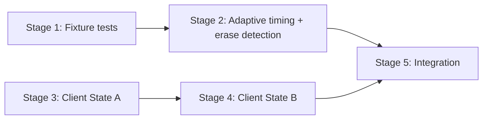

# Plan: Fix Empty Session Display -- Server Detection + Client Fallback

References: ADR_APPROACH2.md

## Open Questions

1. What exact IQR multiplier or percentile cutoff produces the best balance between detecting Codex-style gaps and not over-segmenting Claude Code sessions? The engineer should test with all medium fixtures (claude-medium, codex-medium, gemini-medium) and calibrate empirically.
2. What is the minimum number of "significant gaps" required to consider timing data usable? The ADR suggests checking for ANY gap above 0.5s, but the engineer should validate this against edge cases (e.g., a session with exactly one large gap that is just the startup delay).
3. What score should `\x1b[J` / `\x1b[0J` candidates receive relative to `\x1b[2J`? The ADR suggests 0.6 vs 1.0, but the engineer should verify this produces reasonable merge behavior when both timing and erase-in-display fire near the same event.

## Stages

### Stage 1: Fixture characterization tests

Goal: Add failing tests that run the existing `SectionDetector` against real fixture files and assert non-zero boundaries. These tests fail now and will pass after Stage 2. They serve as the primary regression guard for this bug.

Owner: backend-engineer

- [ ] Add a test case that reads and parses `fixtures/failing-session.cast` (Codex, 1171 events) and asserts `detect()` returns at least 1 boundary
- [ ] Add a test case that reads and parses `fixtures/gemini-medium.cast` (Gemini, 674 events) and asserts `detect()` returns at least 1 boundary
- [ ] Add a regression test that verifies `fixtures/claude-medium.cast` (Claude Code, 1379 events) continues to produce the same number of boundaries (snapshot the current count -- expected: 2 from screen clears)
- [ ] All three fixture tests should be in a dedicated `describe('real fixture detection')` block

Files: `src/server/processing/section_detector.test.ts`
Depends on: none

Considerations:
- The fixtures are already committed in the repo. Read them with `fs.readFileSync` and parse the asciicast v3 format (first line = JSON header, remaining lines = JSON event arrays).
- The Codex and Gemini tests are expected to FAIL at this point. The Claude test should PASS (it validates no regression in existing behavior).
- Keep assertions focused on boundary count and signal types, not exact event indices. Exact positions may shift as thresholds are tuned.

### Stage 2: Adaptive timing + erase-in-display detection

Goal: Implement both server detection improvements from ADR Option S3: (A) relax the timing reliability gate and make the gap threshold adaptive, (B) extend screen clear detection to recognize `\x1b[J` / `\x1b[0J`. After this stage, all Stage 1 fixture tests must pass.

Owner: backend-engineer

#### Part A: Adaptive timing

- [ ] Refactor `isTimingReliable()`: instead of `median >= 0.1s`, check whether the session has at least N gaps above a significance floor (e.g., 0.5s). If yes, timing data is usable even if the median is low. Sessions with zero gaps above the floor remain filtered out.
- [ ] Refactor `detectTimingGaps()`: replace the fixed `TIMING_GAP_THRESHOLD = 5` with an adaptive threshold computed from the session's gap distribution (e.g., `P75 + k * IQR` with a minimum floor of 0.5s). Gaps exceeding the adaptive threshold become candidates.
- [ ] Ensure the adaptive threshold has a minimum floor so that sessions with uniformly tiny gaps do not produce spurious boundaries.
- [ ] Verify `detectVolumeBursts()` also activates correctly under the new reliability gate.

#### Part B: Erase-in-display detection

- [ ] Extend `detectScreenClears()` to also match `\x1b[J` and `\x1b[0J` (erase from cursor to end of screen), not just `\x1b[2J`
- [ ] Score `\x1b[J` / `\x1b[0J` lower than `\x1b[2J` (e.g., 0.6 vs 1.0) because a partial erase is a weaker boundary signal than a full screen clear
- [ ] Do NOT detect `\x1b[2K` (erase-line) -- it fires too frequently in Gemini sessions (323 times in 674 events) and would over-segment

#### Verification

- [ ] Run the Stage 1 Codex fixture test -- must now pass (non-zero boundaries)
- [ ] Run the Stage 1 Gemini fixture test -- must now pass (non-zero boundaries)
- [ ] Run the Stage 1 Claude regression test -- must still produce the same boundary count
- [ ] Run ALL existing `section_detector.test.ts` tests -- must all pass unchanged
- [ ] Log the detected boundaries for each fixture (count, event indices, signals) for manual review

Files: `src/server/processing/section_detector.ts`, `src/server/processing/section_detector.test.ts`
Depends on: Stage 1

Considerations:
- The IQR-based approach for Codex: most gaps are ~0.03s, so P75 is ~0.04s, IQR is ~0.03s. With k=1.5, threshold would be ~0.085s -- too low, would flag many small gaps. The engineer needs to either use a higher multiplier (k=3 or higher) or combine with the minimum floor (0.5s) to prevent over-detection. Test empirically.
- For Claude Code: the existing tests use synthetic events with 0.1s median gap and explicit 10s+ gaps. The adaptive threshold must still detect these -- verify the IQR calculation produces a threshold well below 10s for these synthetic sessions.
- The `MIN_SECTION_SIZE = 100` filter is critical for preventing over-segmentation from `\x1b[J`. With 32 candidates and 100-event minimum sections, the output should be 8-15 sections for the Codex fixture. If it is significantly higher, the `\x1b[J` score or the merge window may need adjustment.
- Watch out for the interaction between adaptive timing and `\x1b[J` candidates near the same event. The merge window (50 events) handles this, but verify with the Codex fixture (event 31 has a 4.6s gap; event 36 has a scroll-region + erase).

### Stage 3: Client fallback -- State A (zero sections, completed)

Goal: When `detection_status === 'completed'` and `sections.length === 0` but a snapshot exists, `SessionDetailView.vue` renders the full snapshot as a continuous document with an informational banner.

Owner: frontend-engineer

- [ ] In `SessionDetailView.vue`, add a rendering branch between the existing `error` branch and the `!hasContent` branch that checks: `detectionStatus === 'completed' && sections.length === 0 && snapshot !== null`
- [ ] Render an informational (non-error) banner communicating that section boundaries were not found. Use design system tokens only (`--text-muted`, `--surface-raised`, `--border-subtle` or similar).
- [ ] Below the banner, render `TerminalSnapshotComponent` with the full snapshot lines, wrapped in the terminal chrome styling and `OverlayScrollbar`
- [ ] Ensure the `useSession` composable's `detectionStatus` ref is used in the template (it is already exposed but unused)
- [ ] Verify the session list view does NOT show any error indicator for zero-section completed sessions (check `SessionCard.vue` or equivalent list item component)

Files: `src/client/pages/SessionDetailView.vue`
Depends on: none (parallel with Stages 1-2)

Considerations:
- The banner text should frame this as a limitation, not a failure. Something like: "Section boundaries could not be detected for this session. Showing full session content."
- The `TerminalSnapshotComponent` expects `lines` and `startLineNumber` props. For the full snapshot, pass `snapshot.lines` and `startLineNumber: 1`.
- The terminal chrome styling (`.terminal-chrome`, `OverlayScrollbar`) should be reused from `SessionContent.vue` or extracted. If duplication is minimal, inline it; if significant, extract a shared wrapper.

### Stage 4: Client fallback -- State B (processing failed)

Goal: When `detection_status === 'failed'`, `SessionDetailView.vue` renders an error banner. If a snapshot exists, it is shown below the error banner. If no snapshot exists, a clear error message is shown.

Owner: frontend-engineer

- [ ] Add a rendering branch in `SessionDetailView.vue` for `detectionStatus === 'failed'` (before the State A branch)
- [ ] When snapshot exists: render an error banner ("Session processing failed. Showing available content.") plus `TerminalSnapshotComponent` with the full snapshot
- [ ] When no snapshot exists: render a clear error state ("Session processing failed and no content is available.")
- [ ] Error banner uses `--status-error` or equivalent design system error token
- [ ] Ensure the `'interrupted'` status is also handled (treat same as `'failed'` for rendering purposes, or show a distinct message)

Files: `src/client/pages/SessionDetailView.vue`
Depends on: Stage 3 (same file, sequential to avoid conflicts)

Considerations:
- The existing `error` ref in `useSession` handles fetch-level errors (404, network failure). The `detectionStatus === 'failed'` branch handles pipeline-level failures where the API returned 200 but the processing stage itself failed. These are different error types -- do not conflate them.
- Edge case: `detection_status === 'failed'` with `sections.length > 0` (partial processing). Treat this as the normal rendering path -- sections exist, show them, but maybe add a warning banner.

### Stage 5: Integration verification

Goal: Verify the full flow end-to-end. Run all tests, verify detection output against all fixtures, confirm the client fallback states render correctly.

Owner: backend-engineer

- [ ] Run the full test suite (`npx vitest run`) -- all tests pass
- [ ] Run the section detector against all medium fixtures and log boundary counts:
  - `fixtures/failing-session.cast` (Codex): expect 5+ boundaries
  - `fixtures/codex-medium.cast` (Codex): expect same as failing-session (they are the same file)
  - `fixtures/gemini-medium.cast` (Gemini): expect 5+ boundaries
  - `fixtures/claude-medium.cast` (Claude): expect >= 2 boundaries (no regression)
- [ ] Verify that existing tests (all 323+) pass with no modifications
- [ ] Add or update any snapshot tests if rendering changes affect them

Files: `src/server/processing/section_detector.test.ts` (verification only, may add integration-style assertions)
Depends on: Stages 1-4

Considerations:
- Visual regression tests (`npm run test:visual`) should be run locally before pushing to CI, per project feedback memory.
- If Playwright tests exist for the session detail page, verify they still pass.

## Dependencies

- Stages 1-2 (server) and Stage 3 (client) can run in **parallel** -- no file overlap
- Stage 4 depends on Stage 3 (same file: `SessionDetailView.vue`)
- Stage 5 depends on all prior stages

## Progress

Updated by engineers as work progresses.

| Stage | Status | Notes |
|-------|--------|-------|
| 1 | pending | |
| 2 | pending | |
| 3 | pending | |
| 4 | pending | |
| 5 | pending | |
