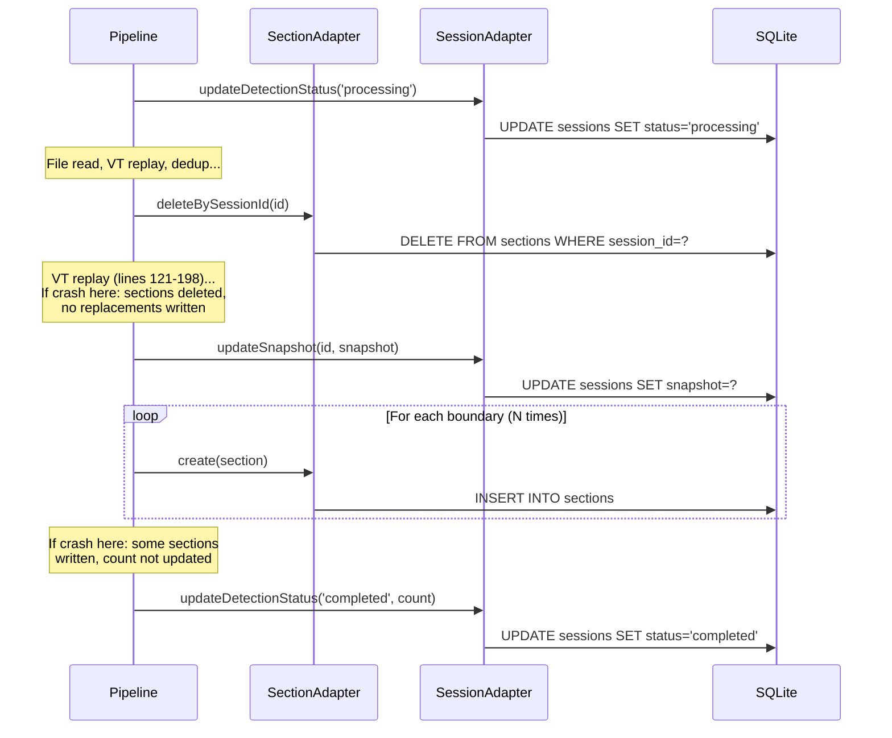
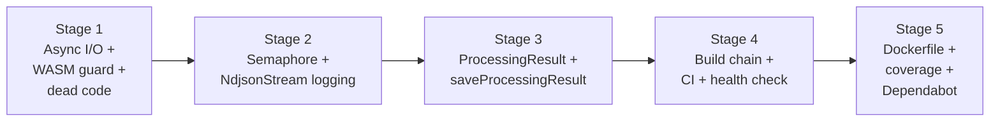
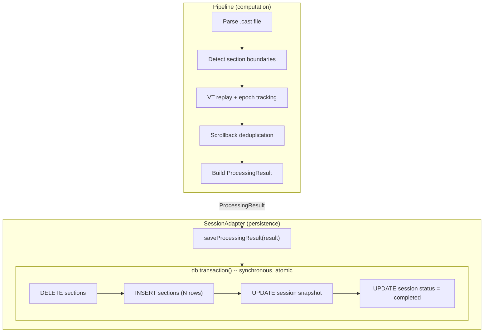
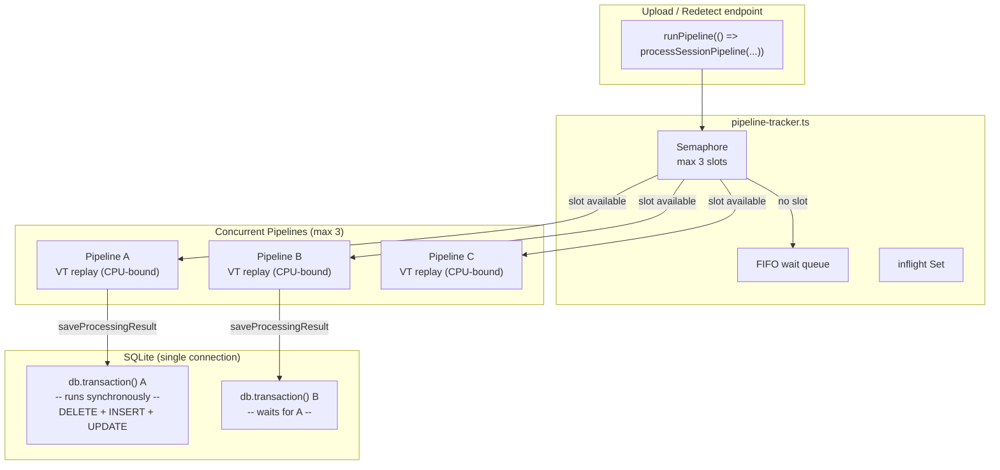
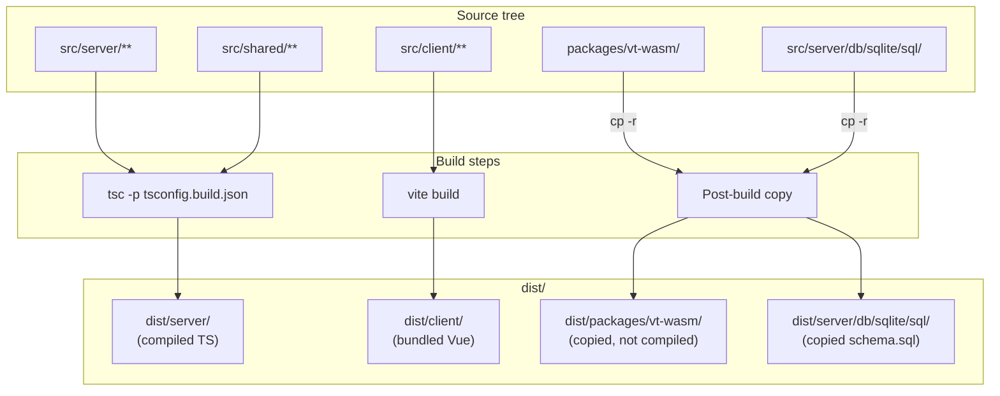
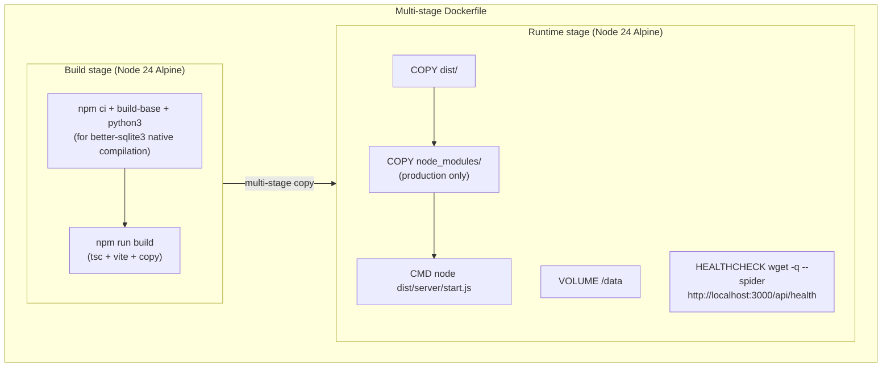

# ADR: Harden the Foundation (A1 Runtime Safety + A2 Build & Deploy)

## Status
Proposed

## Context

The architecture review (`.research/step1/ARCHITECTURE-REVIEW.md`) identified 6 critical, 10 high, and 19 medium findings across the codebase. The Part 4 recommendation is: **Start with Variant A ("Harden the Foundation"), plan for Variant B.**

This ADR covers the first two stages of Variant A:

- **A1 (Runtime Safety):** Fix synchronous file I/O that blocks the event loop, add WASM resource guards, add pipeline concurrency control, make pipeline DB writes atomic, log silently swallowed errors, and remove dead code.
- **A2 (Build & Deploy):** Create a production build chain (currently broken), add a Dockerfile, add `tsc --noEmit` to CI, set coverage thresholds, and add Dependabot.

These are hardening changes -- no new features, no new abstractions. The goal is to make what exists production-ready.

### Forces

1. **C2 is a blocking deficiency.** `FsStorageImpl` uses `readFileSync`/`writeFileSync`/`unlinkSync`/`existsSync`/`mkdirSync` (all from `node:fs`) wrapped in async method signatures. A 250MB session file freezes the event loop during read/write. The `StorageAdapter` interface already declares async signatures, so fixing this requires no interface change.

2. **C1 blocks deployment.** `npm run start` expects `dist/server/start.js` which is never compiled. `tsconfig.json` sets `allowImportingTsExtensions: true` which blocks emit, but the codebase actually uses `.js` extensions throughout (verified: zero `.ts` extension imports in `src/server/`). A `tsconfig.build.json` that drops `allowImportingTsExtensions` and enables emit is sufficient.

3. **H1+H2+H3 compound under load.** Unbounded pipeline concurrency + no transaction boundaries + WASM leak on error = OOM and data corruption under concurrent uploads.

4. **H2 has a transaction design constraint.** The pipeline writes across two tables (`sessions` and `sections`) with 5+ sequential `await` calls and no atomicity. A crash mid-loop leaves orphaned data. The transaction boundary must live inside the adapter layer because `better-sqlite3`'s `db.transaction()` is synchronous and cannot wrap async pipeline code.

5. **M11 is noise.** `session-processor.ts` is dead code (superseded by `session-pipeline.ts`), re-exported from `processing/index.ts` (line 19) but never called by any route or pipeline. The `processing/index.ts` doc comment (lines 1-16) references the dead `processSession` function.

6. **M8 hides data corruption.** `NdjsonStream` lines 55-57 silently swallow malformed JSON with `catch { continue }`. Partially corrupt files process without any warning.

7. **No type checking in CI.** `tsc --noEmit` is not in the CI pipeline, so type errors can reach main undetected.

### Current Pipeline DB Writes

The pipeline currently writes to the database through 7+ individual adapter calls with no atomicity:



Every arrow is a separate statement with no transaction wrapping. A failure at any point leaves the database in an inconsistent state.

### Variant Split

This work crosses two workflow variants:

- **Stages 1-3** touch `src/server/**` and `packages/**` -- backend variant (`feat/server-*`, scopes: `server`, `db`, `wasm`)
- **Stages 4-5** touch CI config, Docker, `tsconfig.build.json`, `vite.config.ts` -- chore variant (`chore/`, scopes: `ci`, `config`)

This is acceptable because the stage groups stay within their variant's allowed paths. The ADR and PLAN live in a shared state directory since they describe a single architectural decision spanning both variants.

## Options Considered

### Option 1: Five sequential PRs (chosen)

Split into 5 strictly sequential PRs:
- Stage 1: Async I/O + WASM guard + dead code removal (~80 lines changed, 3 files modified + 2 deleted)
- Stage 2: Pipeline concurrency semaphore + NdjsonStream logging (~100 lines, 3-4 files)
- Stage 3: ProcessingResult + saveProcessingResult (~120 lines, 5-6 files)
- Stage 4: Production build chain + CI type checking + health check (~80 lines, 4-5 files)
- Stage 5: Dockerfile + coverage thresholds + Dependabot (~100 lines, 4 new files)

All stages are strictly sequential: 1 then 2 then 3 then 4 then 5.

- **Pros:** Small, independently reviewable PRs. Each stage has a single concern. No merge conflicts because stages are sequential. Rollback is granular. Transaction design (Stage 3) builds on semaphore (Stage 2) cleanly.
- **Cons:** Five PRs for hardening work is process-heavy. Calendar time is longer than parallel development.

### Option 2: Parallel Stages 1+2, then sequential 3+4+5

Same content as Option 1, but develop Stages 1 and 2 in parallel since they touch mostly different files.

- **Pros:** Slightly faster calendar time.
- **Cons:** Both Stages 1 and 2 modify `session-pipeline.ts`. Stage 1 adds `try/finally` around lines 121-204. Stage 2 changes call sites in `upload.ts` and `sessions.ts`. The merge conflict in `session-pipeline.ts` would be nontrivial. The calendar time savings (hours, not days) do not justify the risk.

### Option 3: Two PRs (runtime + build)

Combine Stages 1+2+3 into one "Runtime Safety" PR and Stages 4+5 into one "Build & Deploy" PR.

- **Pros:** Fewer PRs, less overhead.
- **Cons:** The runtime safety PR touches 8+ files across three different concerns (I/O, concurrency, transactions). Harder to review. A revert would undo all runtime changes at once.

## Decision

**Option 1: Five sequential PRs.**

The five-stage sequential split was chosen after an adversarial review process identified that parallelizing Stages 1 and 2 would create a nontrivial merge conflict in `session-pipeline.ts`. The slight calendar cost of sequential development is justified by zero merge conflicts and cleaner review boundaries.

### Sequencing



### Key Design Decisions

#### Transaction design: ProcessingResult + saveProcessingResult (H2)

This was the most debated design decision. Three approaches were considered and rejected before arriving at the final design.

**Rejected approaches:**

*Approach A: `runInTransaction` on `DatabaseContext`.* Add a `runInTransaction(fn)` method and have the pipeline call it around its DB writes. **Rejected.** The pipeline is `async` and its DB operations use `await`. `better-sqlite3`'s `db.transaction()` is synchronous. Wrapping `await` calls in a synchronous callback creates an impedance mismatch. Using explicit `BEGIN`/`COMMIT`/`ROLLBACK` via `db.exec()` would work for single-connection SQLite but creates a concurrency hazard when two pipelines share the same connection.

*Approach B: `replaceSections` + `completeProcessing` on adapters.* Add batch methods to both `SectionAdapter` and `SessionAdapter`. **Rejected.** These names do not map to any recognizable engineering pattern. They are arbitrary method groupings -- `replaceSections` bundles delete + N inserts, `completeProcessing` bundles snapshot update + status update. They describe SQL operations, not domain concepts. The pipeline still orchestrates writes across two adapters with no cross-table atomicity.

*Approach C: Async `withTransaction` using `BEGIN`/`COMMIT`/`ROLLBACK`.* **Rejected.** While `BEGIN` state persists on a single SQLite connection across `await` boundaries, two concurrent pipelines sharing the same connection would conflict -- the second `BEGIN` fails because a transaction is already active. The semaphore limits concurrency but does not eliminate this hazard unless set to 1.

**Chosen approach: Result Object + Aggregate Root persistence.**

The pipeline produces a typed **ProcessingResult** -- the complete output of session processing. The `SessionAdapter` receives it via `saveProcessingResult(result)` and persists it atomically. The transaction boundary lives inside the adapter, invisible to the pipeline.



This design works because:

- **The pipeline becomes a pure computation.** It reads the file, replays VT, detects sections, deduplicates scrollback, and produces a `ProcessingResult`. It does not manage transactions or orchestrate cross-table writes.
- **The adapter owns the transaction.** The SQLite implementation uses `db.transaction()` which is synchronous -- the entire delete + insert + update sequence runs to completion before returning. No async/sync impedance mismatch.
- **The pipeline drops `SectionAdapter` as a dependency.** Currently the pipeline receives both `sectionRepo` and `sessionRepo`. After this change, it only receives `sessionRepo`. Section writes are internal to `saveProcessingResult`.
- **Old sections survive until replacement.** Currently, `deleteBySessionId` runs at line 114 before VT replay. If VT replay fails (lines 121-198), sections are gone with no replacement. With `saveProcessingResult`, the delete happens atomically with the insert -- old sections remain until the replacement is ready.
- **Future PostgreSQL works naturally.** A PostgreSQL implementation uses `BEGIN`/`COMMIT`/`ROLLBACK` with a dedicated connection from the pool. Same interface, no design changes.

The `ProcessingResult` type:

```typescript
interface ProcessingResult {
  sessionId: string;
  snapshot: string;                // JSON-serialized TerminalSnapshot
  sections: CreateSectionInput[];  // Sections to create (replaces all existing)
  eventCount: number;
  detectedSectionsCount: number;
}
```

The new method on `SessionAdapter`:

```typescript
interface SessionAdapter {
  // ... existing methods unchanged ...
  saveProcessingResult(result: ProcessingResult): Promise<void>;
}
```

The SQLite implementation prepares its own section statements (INSERT and DELETE) for use inside the synchronous `db.transaction()` callback. This duplicates two SQL statements from `SqliteSectionImpl`, which is acceptable because:
- The duplication is localized to one class and serves a distinct purpose (atomic aggregate persistence vs. individual CRUD)
- It avoids coupling between adapter implementations
- The SQL is trivial (one INSERT, one DELETE)

#### Concurrency model



Key properties:
- `runPipeline(fn)` acquires a semaphore slot before calling `fn()`, releases in `finally`
- Each pipeline's `saveProcessingResult` call is a synchronous `db.transaction()` -- it runs to completion before returning
- SQLite serializes concurrent write transactions via WAL mode -- no explicit mutex needed beyond the semaphore
- The semaphore prevents OOM from unbounded WASM allocations, not DB contention

**Semaphore integration (H1):** The current `trackPipeline(promise)` receives an already-started promise -- the pipeline is executing when tracking begins (`upload.ts:96-98`). A semaphore inside `trackPipeline` would gate tracking, not execution. The solution is `runPipeline(fn)` which acquires a slot, calls `fn()`, and releases in `finally`. This replaces `trackPipeline` at all call sites.

**WASM resource guard (H3):** Wrap the VT lifecycle in `try/finally` to guarantee `vt.free()` even on error. The `vt` variable is created at `session-pipeline.ts:121` and freed at line 204 -- 83 lines of code between creation and cleanup with only the outer try/catch protecting it.

**Async file I/O (C2):** Replace all `node:fs` sync imports in `FsStorageImpl` with `node:fs/promises`. The `StorageAdapter` interface already declares async signatures, so no interface change needed. `SqliteDatabaseImpl.initialize()` also uses `readFileSync` and `mkdirSync` (lines 7, 39, 58) but this is startup-only sync I/O that runs before the HTTP server starts -- documented as an accepted exception.

**NdjsonStream error logging (M8):** Add a `malformedLineCount` property to `NdjsonStream` and increment it on catch (line 55). After the `for await` loop in `session-pipeline.ts`, log a warning if `stream.malformedLineCount > 0`.

**Import extensions (C1):** The `.ts` extension concern identified in the original architecture review is a phantom problem. Grep confirms zero `.ts` extension imports in `src/server/` -- the codebase uses `.js` extensions throughout. `tsconfig.build.json` simply drops `allowImportingTsExtensions` and enables emit.

**Docker health check (M14):** Use `wget -q --spider` instead of `curl` because Alpine Linux ships `wget` but not `curl`.

#### Build and deploy architecture



The WASM package must be copied because:
- `session-pipeline.ts:28` imports `from '../../../packages/vt-wasm/index.js'` using a relative path
- After compilation to `dist/server/processing/session-pipeline.js`, this path resolves to `dist/packages/vt-wasm/index.js`
- `tsc` does not copy non-TS files, so the WASM package needs explicit copying

The SQL schema must be copied because:
- `sqlite_database_impl.ts:57` uses `join(__dirname, 'sql', 'schema.sql')` with runtime `__dirname` resolution
- After compilation, `__dirname` is `dist/server/db/sqlite/`, so `schema.sql` must exist at `dist/server/db/sqlite/sql/schema.sql`



## Consequences

### What becomes easier
- Deploying to production (build chain exists, Dockerfile exists)
- Reasoning about pipeline safety (atomic result persistence, bounded concurrency, WASM cleanup)
- Catching type errors before merge (tsc in CI)
- Detecting file corruption (NdjsonStream logs malformed lines)
- Future PostgreSQL migration (`saveProcessingResult` interface works with real async transactions)
- Pipeline testing (pipeline produces a result object, testable without DB)

### What becomes harder
- Nothing measurably harder. These are pure improvements with no trade-offs against current capabilities.

### Follow-ups to scope for later
- Pipeline decomposition into stage functions (Variant B prerequisite, out of scope here)
- Rate limiting on upload endpoint (H4 -- not addressed in A1/A2)
- Error sanitization in API responses (M9 -- belongs in A4)
- Upload triple-parse reduction (M3 -- belongs in later optimization)

## Decision History

1. **Five-stage sequential split** chosen over parallel stages or mega-PR, driven by merge conflict analysis showing Stages 1 and 2 both modify `session-pipeline.ts`.
2. **ProcessingResult + saveProcessingResult** chosen for transaction safety. Three alternatives were rejected: `runInTransaction` on DatabaseContext (async/sync impedance mismatch), `replaceSections` + `completeProcessing` batch methods (arbitrary groupings, no cross-table atomicity, not a recognizable pattern), and async `withTransaction` using BEGIN/COMMIT/ROLLBACK (concurrent connection contention). The Result Object + Aggregate Root pattern emerged as the correct abstraction: the pipeline computes, the adapter persists atomically.
3. **`runPipeline(fn)` wrapper** chosen over modifying `trackPipeline` because `trackPipeline` receives an already-started promise -- the semaphore must be acquired before pipeline execution begins.
4. **`SqliteDatabaseImpl` sync I/O** accepted as an exception -- startup-only, runs before HTTP server starts, does not block request handling.
5. **`.ts` import extension concern dismissed** -- the codebase uses `.js` extensions throughout, making the build config straightforward.
6. **Variant split** (backend vs chore) is handled by using separate branches with appropriate prefixes for each stage group.
7. **SQL duplication in SessionAdapter** accepted -- the SQLite implementation of `saveProcessingResult` prepares its own section INSERT and DELETE statements rather than depending on `SqliteSectionImpl`. This avoids coupling between adapter implementations.
