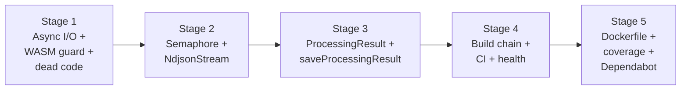

# Plan: Harden the Foundation (A1 Runtime Safety + A2 Build & Deploy)

References: ADR.md

## Open Questions

None. All design questions have been resolved through the adversarial review process and documented in the ADR Decision History.

## Stages

All stages are strictly sequential: 1 -> 2 -> 3 -> 4 -> 5. No parallel stages.

### Stage 1: Async File I/O + WASM Guard + Dead Code Removal

Goal: Eliminate event loop blocking in FsStorageImpl, guarantee WASM cleanup on error, and remove dead code.

Owner: backend-engineer
Branch: `feat/server-async-io-wasm-guard`

- [ ] Convert `FsStorageImpl` from `node:fs` sync to `node:fs/promises`
  - Replace `readFileSync` with `fs.readFile` (`read` method, line 49)
  - Replace `writeFileSync` with `fs.writeFile` (`save` method, line 36)
  - Replace `unlinkSync` with `fs.unlink` (`delete` method, line 61)
  - Replace `existsSync` with `fs.access` + try/catch (`read`, `delete`, `exists` methods)
  - Replace `mkdirSync` with `fs.mkdir` (`save` method, line 35)
  - Update import from `node:fs` to `node:fs/promises` (line 6)
  - No interface change needed -- `StorageAdapter` already declares async signatures
- [ ] Add `try/finally` around WASM lifecycle in `session-pipeline.ts`
  - Wrap lines 121-204: `const vt = createVt(...)` through `vt.free()`
  - Move `vt.free()` from line 204 into a `finally` block
  - Ensure `vt` is declared with `let` before the try so `finally` can access it
  - The outer try/catch for error status update (line 265-268) stays as-is
  - The `try/finally` nests inside the outer `try/catch`
- [ ] Delete `session-processor.ts` and its test (dead code, M11)
  - Delete `src/server/processing/session-processor.ts`
  - Delete `src/server/processing/session-processor.test.ts`
  - Remove the re-export from `src/server/processing/index.ts` (line 19: `export { processSession, type ProcessingResult } from './session-processor.js';`)
  - Update the module-level doc comment in `processing/index.ts` (lines 1-16) to remove `processSession` references and `SessionProcessor` mention
  - Verify no other files import from `session-processor` (confirmed: only `index.ts` re-exports it)
- [ ] Write/update tests
  - Test `FsStorageImpl` async behavior: verify `save`, `read`, `delete`, `exists` work correctly with `fs/promises`
  - Test WASM cleanup on pipeline error: mock `createVt` to verify `free()` is called even when processing throws

Files:
- `src/server/storage/fs_storage_impl.ts` (modify)
- `src/server/processing/session-pipeline.ts` (modify)
- `src/server/processing/session-processor.ts` (delete)
- `src/server/processing/session-processor.test.ts` (delete)
- `src/server/processing/index.ts` (modify -- remove re-export, update doc comment)

Depends on: none

Considerations:
- `fs.access` throws on missing file rather than returning false like `existsSync`. Use try/catch pattern: `try { await fs.access(path); return true; } catch { return false; }`.
- `SqliteDatabaseImpl.initialize()` (lines 7, 39, 58) also uses `readFileSync` and `mkdirSync`. This is an accepted exception -- startup-only sync I/O that runs before the HTTP server starts. Add a code comment documenting this decision.
- The WASM `try/finally` must nest inside the outer `try/catch` that sets detection status to 'failed', not replace it.
- `session-pipeline.test.ts` covers the same pipeline behaviors through integration tests. Safe to delete `session-processor.test.ts`.

### Stage 2: Pipeline Concurrency Semaphore + NdjsonStream Logging

Goal: Bound concurrent pipeline executions and surface malformed JSON warnings.

Owner: backend-engineer
Branch: `feat/server-pipeline-concurrency`

- [ ] Replace `trackPipeline(promise)` with `runPipeline(fn)` in `pipeline-tracker.ts`
  - Remove `trackPipeline` function
  - Add `MAX_CONCURRENT_PIPELINES` constant (default: 3)
  - Implement `runPipeline(fn: () => Promise<void>): void` that:
    - Acquires a semaphore slot (waits if all slots taken)
    - Calls `fn()` and tracks the returned promise
    - Releases slot in `finally` after promise settles
    - Removes promise from inflight set in `finally`
  - FIFO queue: array of waiting `{ resolve }` objects, shift from front on release
  - `waitForPipelines()` stays as-is (waits for inflight set)
- [ ] Update call sites to use `runPipeline(fn)` instead of `trackPipeline(promise)`
  - `src/server/routes/upload.ts` lines 96-98: change from `const pipeline = processSessionPipeline(...); trackPipeline(pipeline);` to `runPipeline(() => processSessionPipeline(...))`
  - `src/server/routes/sessions.ts` lines 199-206: same pattern in `handleRedetect`
  - `src/server/scripts/migrate-v2.ts` does NOT change -- it calls `processSessionPipeline` directly with `await` in a serialized loop
  - Update the import in `src/server/processing/index.ts` (line 22) to export `runPipeline` instead of `trackPipeline`
  - Update the import in `src/server/index.ts` if `waitForPipelines` export name changes
- [ ] Add `malformedLineCount` to `NdjsonStream`
  - Add a public `malformedLineCount: number = 0` property to the class
  - Increment in the catch block (line 55)
  - Also increment when a non-array value is encountered after the header (line 53 area)
- [ ] Add malformed line warning in `session-pipeline.ts`
  - After the `for await` loop (after line 69), check `stream.malformedLineCount > 0`
  - Log: `log.warn({ sessionId, malformedLines: stream.malformedLineCount }, 'Skipped malformed lines in .cast file')`
- [ ] Write tests
  - Semaphore: test that 4th concurrent call to `runPipeline` waits until one of the first 3 completes
  - Semaphore: test FIFO ordering (first waiter gets the next available slot)
  - Semaphore: test that slot is released even when pipeline throws
  - NdjsonStream: test that malformed JSON lines increment `malformedLineCount`
  - NdjsonStream: test that non-array event lines increment `malformedLineCount`

Files:
- `src/server/processing/pipeline-tracker.ts` (modify -- replace trackPipeline with runPipeline)
- `src/server/processing/pipeline-tracker.test.ts` (new)
- `src/server/processing/ndjson-stream.ts` (modify -- add malformedLineCount)
- `src/server/processing/session-pipeline.ts` (modify -- add malformed line warning after stream loop)
- `src/server/routes/upload.ts` (modify -- use runPipeline)
- `src/server/routes/sessions.ts` (modify -- use runPipeline in handleRedetect)
- `src/server/processing/index.ts` (modify -- export runPipeline instead of trackPipeline)

Depends on: Stage 1

Considerations:
- The `.catch(err => log.error(...))` at call sites (`upload.ts:97`, `sessions.ts:205`) should move inside the `fn` callback or be handled by `runPipeline` itself. The implementer should decide where error logging belongs.
- `migrate-v2.ts` imports `processSessionPipeline` directly from `session-pipeline.js` (line 17), not through `index.ts`. It does not use `trackPipeline` and does not need `runPipeline` -- it serializes its own work via `await` in a loop.
- The semaphore must handle the case where `fn()` throws -- the slot must still be released. Use `try/finally`.

### Stage 3: ProcessingResult + saveProcessingResult (Transaction Safety)

Goal: Make pipeline DB writes atomic by introducing a ProcessingResult type and a single `saveProcessingResult` method on SessionAdapter. The pipeline becomes a pure computation that produces a result; the adapter persists it atomically inside a `db.transaction()`.

Owner: backend-engineer
Branch: `feat/server-processing-result`

- [ ] Define `ProcessingResult` type
  - Create in `src/server/processing/types.ts` (new file)
  - Fields: `sessionId: string`, `snapshot: string`, `sections: CreateSectionInput[]`, `eventCount: number`, `detectedSectionsCount: number`
  - Import `CreateSectionInput` from `../db/section_adapter.js`
  - Export the type for use by the pipeline and adapter
- [ ] Add `saveProcessingResult` to `SessionAdapter` interface
  - Add to `src/server/db/session_adapter.ts`
  - Signature: `saveProcessingResult(result: ProcessingResult): Promise<void>`
  - Doc comment: "Persist the result of session processing. Atomically replaces all sections, stores the snapshot, and marks the session as completed. The implementation owns the transaction boundary."
  - Import `ProcessingResult` from the processing types module
- [ ] Implement `saveProcessingResult` in `SqliteSessionImpl`
  - Prepare section-specific statements in the constructor:
    - `deleteSectionsStmt`: `DELETE FROM sections WHERE session_id = ?` (same SQL as `SqliteSectionImpl.deleteBySessionIdStmt`)
    - `insertSectionStmt`: `INSERT INTO sections (id, session_id, type, start_event, end_event, label, snapshot, start_line, end_line) VALUES (?, ?, ?, ?, ?, ?, ?, ?, ?)` (same SQL as `SqliteSectionImpl.insertStmt`)
  - Create a `db.transaction()` wrapper in the constructor that:
    1. Deletes all existing sections for the session
    2. Inserts all new sections (loop with `nanoid()` for each ID)
    3. Updates the session snapshot
    4. Updates detection status to 'completed' with event count and section count
  - The async `saveProcessingResult` method calls the synchronous transaction function
- [ ] Refactor pipeline to produce `ProcessingResult`
  - Remove `sectionRepo: SectionAdapter` from `processSessionPipeline` function signature
  - Remove `import type { SectionAdapter }` from imports (line 19)
  - Remove the early `deleteBySessionId` call at line 114 (this moves inside the adapter)
  - In the boundary loop (lines 218-251), collect sections into a `CreateSectionInput[]` array instead of calling `await sectionRepo.create(...)` individually
  - After the loop, build a `ProcessingResult` object with all computed data
  - Replace the three separate DB calls (lines 212, 228-249, 259-264) with a single `await sessionRepo.saveProcessingResult(result)`
  - The `updateDetectionStatus('processing')` call at line 55 stays as-is (status transition before processing)
  - The `updateDetectionStatus('failed')` call at line 268 stays as-is (error path, outside the result)
- [ ] Update all call sites that pass `sectionRepo` to the pipeline
  - `src/server/routes/upload.ts` line 96: remove `sectionRepository` argument from `processSessionPipeline(...)` call
  - `src/server/routes/sessions.ts` line 199-204: remove `sectionRepository` argument from `processSessionPipeline(...)` call in `handleRedetect`
  - `src/server/scripts/migrate-v2.ts` lines 103, 136: remove `sectionRepo` argument from both `processSessionPipeline(...)` calls
  - Update `migrateV2` function signature (line 50-53) and `processPendingSessions` (line 88-92) to no longer receive `sectionRepo` if it was only used for pipeline calls -- verify whether `sectionRepo` is used elsewhere in migrate-v2
- [ ] Update `processing/index.ts` to export `ProcessingResult` type
- [ ] Write tests
  - Test `saveProcessingResult` atomicity: insert a session, call `saveProcessingResult`, verify sections and session are updated. Then simulate a failure mid-transaction (e.g., invalid section data) and verify no partial state remains.
  - Test `saveProcessingResult` replacement: call it twice with different sections, verify only the second set remains
  - Test pipeline produces correct `ProcessingResult` (unit test with mock session adapter)
  - Use in-memory SQLite (`:memory:`) for adapter tests

Files:
- `src/server/processing/types.ts` (new -- ProcessingResult type)
- `src/server/db/session_adapter.ts` (modify -- add saveProcessingResult to interface)
- `src/server/db/sqlite/sqlite_session_impl.ts` (modify -- implement saveProcessingResult with db.transaction)
- `src/server/processing/session-pipeline.ts` (modify -- produce ProcessingResult, remove sectionRepo dependency)
- `src/server/routes/upload.ts` (modify -- remove sectionRepo from pipeline call)
- `src/server/routes/sessions.ts` (modify -- remove sectionRepo from pipeline call in handleRedetect)
- `src/server/scripts/migrate-v2.ts` (modify -- remove sectionRepo from pipeline calls)
- `src/server/processing/index.ts` (modify -- export ProcessingResult type)

Depends on: Stage 2

Considerations:
- The `ProcessingResult` type name does not conflict with the dead `ProcessingResult` type from `session-processor.ts` because that type and its export are deleted in Stage 1. However, verify that `processing/index.ts` no longer re-exports the old `ProcessingResult` after Stage 1's changes.
- `migrate-v2.ts` currently receives both `sessionRepo` and `sectionRepo` in `migrateV2(sessionRepo, sectionRepo)`. After this change, the `sectionRepo` parameter may be removable if it is only used for the pipeline call. Check lines 50-53 and 88-92: `sectionRepo` is passed to `processPendingSessions` which passes it to `processSessionPipeline`. If `sectionRepo` is not used independently, remove it from the migration function signatures.
- The `reprocessMissingSnapshots` function (lines 120-145) also calls `processSessionPipeline` with `sectionRepo` at line 136. This call site must be updated too.
- `SectionAdapter` and `SqliteSectionImpl` are **not modified** in this stage. They retain their existing CRUD methods which are still used by routes (e.g., `findBySessionId` in `sessions.ts:62`, `deleteBySessionId` could still be used by `handleDeleteSession` via cascade). Only the pipeline's usage of `SectionAdapter` for writes is replaced.

### Stage 4: Production Build Chain + CI Type Checking + Health Check

Goal: Make `npm run start` work. Add type checking to CI. Deepen health check with DB ping.

Owner: implementer (chore variant)
Branch: `chore/production-build`

- [ ] Create `tsconfig.build.json` for server compilation
  - Extends `tsconfig.json`
  - Overrides: drop `allowImportingTsExtensions`, set `noEmit: false`, set `outDir: "dist/server"`
  - Set `module: "NodeNext"`, `moduleResolution: "NodeNext"` for Node.js runtime
  - Include only `src/server/**` and `src/shared/**` (not client code)
  - No import rewriting needed -- the codebase uses `.js` extensions throughout
- [ ] Update `package.json` build scripts
  - Add `build:server` script: `tsc -p tsconfig.build.json`
  - Update `build` script to run both `vite build` (client) and `tsc -p tsconfig.build.json` (server)
  - Add post-build copy steps:
    - `cp -r packages/vt-wasm dist/packages/vt-wasm` (WASM package for `session-pipeline.ts:28` relative import)
    - `cp -r src/server/db/sqlite/sql dist/server/db/sqlite/sql` (schema.sql for `sqlite_database_impl.ts:57` `__dirname` reference)
  - Verify `npm run start` (`node dist/server/start.js`) works after build
- [ ] Add static file serving for production
  - In `src/server/index.ts`, conditionally serve `dist/client/` as static files when `NODE_ENV=production`
  - Use `serveStatic` from `@hono/node-server/serve-static`
  - This enables single-container deployment: one process serves both API and frontend
- [ ] Deepen health check endpoint
  - Current: `app.get('/api/health')` in `src/server/index.ts:51-53` returns `{ status: 'ok' }` with no actual checks
  - Add: execute a trivial query (`SELECT 1`) against the database to verify connectivity
  - The health check handler needs access to the DB connection -- pass it through the existing context
  - Return: `{ status: 'ok', db: 'ok' }` or `{ status: 'degraded', db: 'error', detail: '...' }` with 503 status
- [ ] Add `tsc --noEmit` to CI (M13)
  - Add a `typecheck` job to `.github/workflows/ci.yml`
  - Runs `npx tsc --noEmit` after install
  - Parallel with lint, test-unit, test-snapshot jobs
- [ ] Write/update tests
  - Health check: test that endpoint returns db status (integration test with in-memory SQLite)
  - Build: verify `npm run build` succeeds (can be manual verification)

Files:
- `tsconfig.build.json` (new)
- `package.json` (modify -- build scripts)
- `src/server/index.ts` (modify -- static serving + health check DB ping)
- `.github/workflows/ci.yml` (modify -- add typecheck job)

Depends on: Stage 3

Considerations:
- `src/server/index.ts` has a top-level `await` (line 35: `const db = await factory.create()`). This works in ESM with `module: "NodeNext"` since the file is treated as an ES module (`"type": "module"` in `package.json`).
- The `vite build` already outputs to `dist/client/` (configured in `vite.config.ts:26-28`). The `tsc` output goes to `dist/server/`. These do not conflict.
- The current CI `build` job (line 33-59 in `ci.yml`) runs `npm run build` which currently only does `vite build`. After this stage, it will also compile the server. The `dist` artifact upload will include both client and server output.
- The post-build copy for `packages/vt-wasm/` must include `index.js`, `types.js`, and the `pkg/` subdirectory (which contains `vt_wasm.js` and `vt_wasm_bg.wasm`).

### Stage 5: Dockerfile + Coverage Thresholds + Dependabot

Goal: Enable containerized deployment, prevent coverage regression, automate dependency updates.

Owner: implementer (chore variant)
Branch: `chore/container-ci-hardening`

- [ ] Create multi-stage Dockerfile
  - Stage 1 (build): Node 24 Alpine, install `build-base` + `python3` (for `better-sqlite3` native compilation), `npm ci`, `npm run build`
  - Stage 2 (runtime): Node 24 Alpine, copy `dist/`, `node_modules` (production only via `npm ci --omit=dev`), `packages/vt-wasm/pkg/` (already copied to `dist/` by build script, but verify)
  - Expose port 3000
  - CMD: `node dist/server/start.js`
  - Health check: `HEALTHCHECK CMD wget -q --spider http://localhost:3000/api/health || exit 1`
- [ ] Create `.dockerignore`
  - Exclude: `node_modules`, `.git`, `data/`, `.state/`, `.research/`, `design/`, `agents/`, `*.md`, `tests/`, `scripts/`, `.claude/`
- [ ] Add coverage thresholds to vitest config (M12)
  - In `vite.config.ts`, add `coverage.thresholds` under the existing `coverage` config (lines 45-48)
  - Run `npx vitest run --coverage` first to determine current values
  - Set thresholds slightly below current values to prevent regression without blocking immediately
  - Suggested starting point: `{ lines: 70, functions: 70, branches: 60, statements: 70 }` (adjust based on actual numbers)
- [ ] Create Dependabot configuration (M15)
  - `.github/dependabot.yml` for npm ecosystem
  - Weekly schedule
  - Group minor+patch updates together to reduce PR spam
  - Separate groups for production and dev dependencies
  - Limit open PRs (suggested: 5)
- [ ] Verify
  - Build the Docker image locally: `docker build -t ragts .`
  - Run: `docker run -p 3000:3000 ragts`
  - Verify health check returns ok with DB ping
  - Verify frontend is served from the same container

Files:
- `Dockerfile` (new)
- `.dockerignore` (new)
- `vite.config.ts` (modify -- coverage thresholds under `test.coverage`)
- `.github/dependabot.yml` (new)

Depends on: Stage 4

Considerations:
- `better-sqlite3` requires native compilation. Alpine needs `build-base` (provides `make`, `g++`) and `python3` in the build stage. These are NOT needed in the runtime stage.
- The WASM package at `packages/vt-wasm/pkg/` contains pre-built `.wasm` files loaded at runtime. The Stage 4 build script copies this to `dist/packages/vt-wasm/`. Verify this path exists in the Docker build output.
- Coverage thresholds should be conservative. Run coverage locally first and set thresholds 2-5% below actual values to avoid blocking unrelated PRs.
- Dependabot config should use `groups` to batch minor+patch updates. Consider separate groups: `production` (dependencies) and `development` (devDependencies).

## Dependencies

Strict sequential ordering -- no parallel stages:

Rationale for sequential ordering:
- Stages 1 and 2 both modify `session-pipeline.ts` -- sequencing eliminates merge conflicts
- Stage 3 depends on Stage 2 because the semaphore should be in place before aggregate persistence is used (defense in depth)
- Stage 3 depends on Stage 1 because the dead `ProcessingResult` type from `session-processor.ts` is deleted in Stage 1, avoiding a name collision
- Stage 4 depends on Stage 3 because the production build should compile the final corrected code
- Stage 5 depends on Stage 4 because the Dockerfile needs `npm run build` to work

## Git Contract

| Stage | Variant | Branch | Scopes |
|-------|---------|--------|--------|
| 1 | backend | `feat/server-async-io-wasm-guard` | `server`, `wasm` |
| 2 | backend | `feat/server-pipeline-concurrency` | `server` |
| 3 | backend | `feat/server-processing-result` | `server`, `db` |
| 4 | chore | `chore/production-build` | `ci`, `config` |
| 5 | chore | `chore/container-ci-hardening` | `ci`, `config` |

## Progress

Updated by implementer as work progresses.

| Stage | Status | Branch | PR | Notes |
|-------|--------|--------|----|-------|
| 1 | pending | `feat/server-async-io-wasm-guard` | | |
| 2 | pending | `feat/server-pipeline-concurrency` | | |
| 3 | pending | `feat/server-processing-result` | | |
| 4 | pending | `chore/production-build` | | |
| 5 | pending | `chore/container-ci-hardening` | | |
