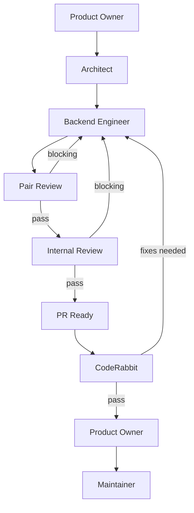

# Backend Workflow

For tasks scoped to server-side code.

## Phases

| # | Agent | Gate |
|---|-------|------|
| 1 | `product-owner` | REQUIREMENTS.md signed off |
| 2 | `architect` | ADR.md + PLAN.md approved |
| 3 | `backend-engineer` | All PLAN stages complete |
| 4 | `reviewer-pair` | Per stage, blocking findings resolved |
| 5 | `reviewer-internal` | No blocking findings |
| 6 | `reviewer-coderabbit` | Valid findings fixed |
| 7 | `product-owner` | Validates against REQUIREMENTS.md |
| 8 | `maintainer` | CI green, all approvals |

## Git Contract

| Rule | Value |
|------|-------|
| Branch prefix | `feat/server-` or `fix/server-` |
| Commit scopes | `server`, `db`, `wasm` |
| Allowed paths | `src/server/**`, `packages/**` |
| PR title | `feat(server): <description>` or `fix(server): <description>` |

Commits touching files outside allowed paths violate this contract. Stop and escalate to coordinator.
